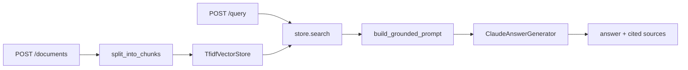

# Architecture

## Why generation is separate from retrieval

`rag/vector_store.py` and `rag/generation.py` know nothing about each other. `RagPipeline` is the only piece that wires them together, which is what makes each one testable on its own: the store is tested with real TF-IDF math and no network calls, and the generator is tested with a mocked HTTP client and no real store.

## Why every answer carries its sources

A RAG answer that cannot be traced back to what it was grounded in is not meaningfully different from an ungrounded one. `build_grounded_prompt` numbers each retrieved chunk and instructs the model to cite those numbers, and the API response returns the chunks themselves alongside the answer, so a caller can verify a claim against the exact text it came from instead of trusting it blindly.

## Where this would need to change for production scale

`TfidfVectorStore` refits its vectorizer on every ingest call and keeps every chunk in memory, which is the right tradeoff for a small, testable demo and the wrong one for a large, frequently updated corpus. A production version would swap in a dense embedding model behind the same `add_documents` / `search` interface and move the index into a real vector database — nothing above that interface would need to know.
